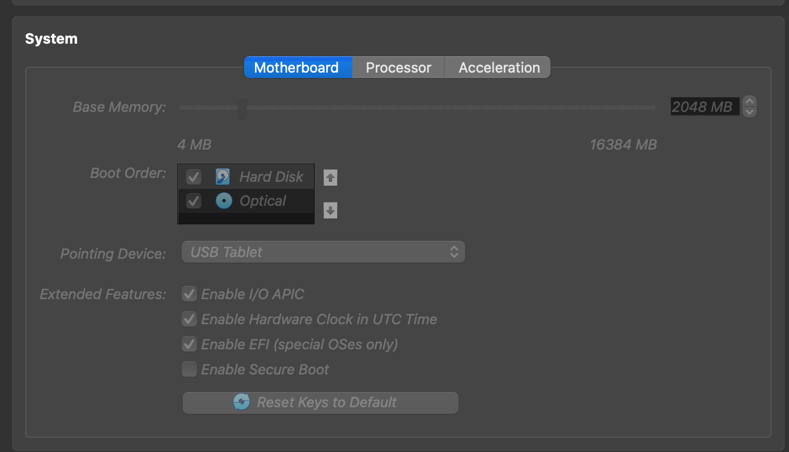
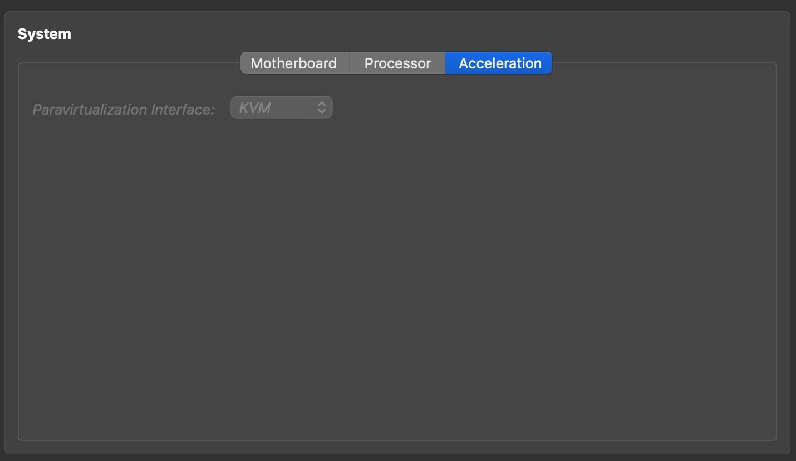

# Virtual box

## Ubuntu Desktop 24.04


**Set up for VM :**


- System
    - Processor : 2 cpu
        - **Must `Enable I/O APIC`** : Because use cpu more than 1 core
        - **Must `Enable Secure Boot`** : Fix critival error.
    - Base memory: 4096MB
    - Acceleration : KVM (Best fit for linux)
    
    
**Execution Step :**
1. Install Ubuntu server version 24.04
2. Install Ubuntu desktop via apt package manager.
    - Reference :
        - https://askubuntu.com/questions/1405124/install-ubuntu-desktop-22-04-arm64-on-macos-apple-silicon-m1-pro-max-in-parall
    - Exection Step :
        1. Run command `sudo apt install ubuntu-desktop`
3. Install essential package
    - Exection Step :
        1. Run command `sudo apt-get install build-essential`
4. Set up for share clipboard
    - Reference :
        - https://www.linuxtechi.com/install-virtualbox-guest-additions-on-ubuntu/
    - Exection Step :
        1. Insert guest addition from Device top navbar.
        2. Install VirtualBox Guest Additions by cd to /media/${your_user} and find the folder `VBox_GAs_*` . Then execute file `VBoxLinuxAdditions-arm64.run`

# Networking
## 1. Setup internal network

**Reference**
- https://www.youtube.com/watch?v=lhOY-KilEeE

**Execution Step :**
1. Create DHSCP server in virtualbox.
    `vboxmanage dhcpserver add --netname testlab --ip 10.10.10.1 --netmask 255.255.255.0 --lowerip 10.10.10.2 --upperip 10.10.10.12 --enable`
2. Fix Ip for each VM.
    ```
    network:
    ethernets:
        enp0s8:
            dhcp4: true
        enp0s9:
            dhcp4: false
            addresses:  
                - 10.10.10.2/24
    version: 2
    ```
## 2. Setup Host-only network

**Description :**
- For ssh 

**Execution Step :**
1. Create Host only-network in virtualbox.
2. Attach to vm.
3. fic ip in netplan `sudo vi /etc/netplan/*`


## Problem 
### 1. When mount VirtualboxGuestAddion to ubuntu server

**Description**

- Optical drive doest mount to /media

**Solve**
- Mount using this command  `sudo mount /dev/sr0 /media/cdrom`.Create cdrom folder first not matter the name.
    - Ref : https://askubuntu.com/questions/321589/unable-to-mount-the-cd-dvd-image-on-the-machine-sandbox